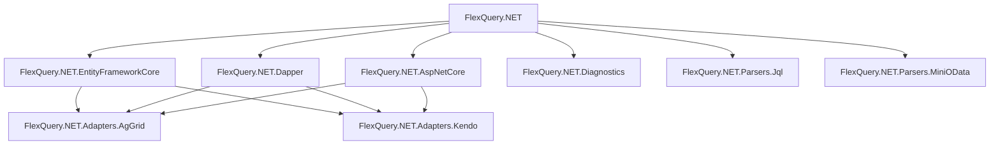

# FlexQuery.NET

**Dynamic filtering, sorting, paging, and projection for IQueryable in .NET.**

[](https://www.nuget.org/packages/FlexQuery.NET)
[](https://www.nuget.org/packages/FlexQuery.NET)
[](https://dotnet.microsoft.com/download)
[](https://flexquery.vercel.app)
[](LICENSE)

FlexQuery.NET is a dynamic query engine for .NET REST APIs. It transforms complex query parameters into secure, server-side expression trees — filtering, sorting, paging, and projecting data with a single line of code.

```csharp
var result = await _context.Users.FlexQueryAsync(parameters, opts =>
{
    opts.AllowedFields = ["Id", "Name", "Email", "Status"];
});
```
Works with Entity Framework Core, Dapper, and other FlexQuery.NET providers.

## Why FlexQuery.NET?

- **No OData Dependency** — Get powerful querying without OData's complexity and tight coupling
- **100% Server-Side** — All operations translate to SQL via expression trees — zero client evaluation
- **Security First** — Declare allowed/blocked fields per-endpoint with strict validation
- **Multi-Format** — Auto-detects DSL, JSON, JQL, and OData query syntax on the same endpoint
- **Multiple Data Providers** — Works with EF Core, Dapper, or any IQueryable source

## Package Ecosystem



| Package | Purpose |
|---|---|
| [FlexQuery.NET](https://www.nuget.org/packages/FlexQuery.NET) | Core query engine — parsing, filtering, sorting, paging, projection, validation |
| [FlexQuery.NET.EntityFrameworkCore](https://www.nuget.org/packages/FlexQuery.NET.EntityFrameworkCore) | Async execution and filtered includes for EF Core |
| [FlexQuery.NET.Dapper](https://www.nuget.org/packages/FlexQuery.NET.Dapper) | SQL generation and execution for Dapper |
| [FlexQuery.NET.AspNetCore](https://www.nuget.org/packages/FlexQuery.NET.AspNetCore) | ASP.NET Core integration with `[FieldAccess]` security attributes |
| [FlexQuery.NET.Diagnostics](https://www.nuget.org/packages/FlexQuery.NET.Diagnostics) | Execution diagnostics, timing, and observability |
| [FlexQuery.NET.Adapters.AgGrid](https://www.nuget.org/packages/FlexQuery.NET.Adapters.AgGrid) | AG Grid Server-Side Row Model (SSRM) request/response adapter |
| [FlexQuery.NET.Adapters.Kendo](https://www.nuget.org/packages/FlexQuery.NET.Adapters.Kendo) | Kendo UI DataSource request adapter |
| [FlexQuery.NET.Parsers.Jql](https://www.nuget.org/packages/FlexQuery.NET.Parsers.Jql) | JQL (Jira Query Language) syntax parser |
| [FlexQuery.NET.Parsers.MiniOData](https://www.nuget.org/packages/FlexQuery.NET.Parsers.MiniOData) | Lightweight OData-compatible syntax parser |

## Supported Query Formats

```http
GET /api/users?filter=age:gte:18&sort=name:asc&page=1&pageSize=20     # DSL (default)
GET /api/users?filter=Age >= 18 AND Status = 'Active'                  # JQL
GET /api/users?$filter=Age ge 18 and Status eq 'Active'               # OData
```

## Getting Started

```bash
dotnet add package FlexQuery.NET.EntityFrameworkCore
```

Full guide: [flexquery.vercel.app/guide/getting-started](https://flexquery.vercel.app/guide/getting-started)

## Documentation

- [Getting Started](https://flexquery.vercel.app/guide/getting-started)
- [Query Composition](https://flexquery.vercel.app/guide/composition)
- [Security & Governance](https://flexquery.vercel.app/guide/security-governance)
- [EF Core Provider](https://flexquery.vercel.app/providers/ef-core)
- [Dapper Provider](https://flexquery.vercel.app/providers/dapper/getting-started)
- [AG Grid Integration](https://flexquery.vercel.app/adapters/ag-grid)
- [Kendo Integration](https://flexquery.vercel.app/adapters/kendo)
- [GitHub Samples](https://github.com/peterjohncasasola/FlexQuery.NET/tree/main/samples)

## License

MIT License. See [LICENSE](LICENSE).
