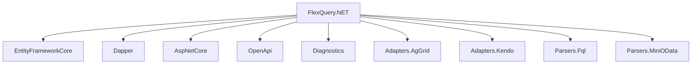

# FlexQuery.NET

**Dynamic filtering, sorting, paging, and projection for IQueryable in .NET.**

[](https://www.nuget.org/packages/FlexQuery.NET)
[](https://www.nuget.org/packages/FlexQuery.NET)
[](https://dotnet.microsoft.com/download)
[](https://flexquery.vercel.app)
[](LICENSE)

FlexQuery.NET is a dynamic query engine for .NET REST APIs. It turns query-string parameters into secure, server-side expression trees — filtering, sorting, paging, and projecting your data with a single call, without ever evaluating LINQ in memory.

## Why FlexQuery.NET?

- **One endpoint, every query** — clients send `filter`, `sort`, `page`, `pageSize`, `select`, and more; your action method stays one line.
- **100% server-side** — every operation translates to SQL via expression trees. No client evaluation, no surprise full-table loads.
- **Security first** — whitelists, blacklists, and per-operation field policies are validated before a query ever reaches the database.
- **Multiple query syntaxes** — the native DSL, FQL (a SQL-inspired language), and a lightweight OData-compatible syntax.
- **Provider choice** — runs on Entity Framework Core, Dapper (with multi-dialect SQL generation), or any `IQueryable` source.

## Quick Start

Install the core package plus a provider:

```bash
dotnet add package FlexQuery.NET
dotnet add package FlexQuery.NET.EntityFrameworkCore
```

Configure once at startup, then bind `FlexQueryParameters` in a controller and pass it to `FlexQueryAsync`:

```csharp
using FlexQuery.NET;

// Program.cs — once, before any query executes
FlexQueryCore.Configure();
FlexQueryEFCore.Setup();
```

```csharp
using FlexQuery.NET.Models;
using Microsoft.AspNetCore.Mvc;

[ApiController]
[Route("api/customers")]
public sealed class CustomersController(AppDbContext db) : ControllerBase
{
    [HttpGet]
    public async Task<IActionResult> GetCustomers(
        [FromQuery] FlexQueryParameters parameters,
        CancellationToken cancellationToken)
    {
        var result = await db.Customers
            .FlexQueryAsync(parameters, opt =>
            {
                opt.AllowedFields = ["Id", "FirstName", "LastName", "Email", "Status"];
                opt.MaxPageSize = 100;
                opt.DefaultSortField = "Id";
            }, cancellationToken);

        return Ok(result);
    }
}
```

That's the whole endpoint. A request like:

```http
GET /api/customers?filter=Status:eq:Active&sort=LastName:asc&page=1&pageSize=20&select=Id,FirstName,Email
```

returns a paged, validated, SQL-translated result:

```json
{
  "data": [
    { "id": 3, "firstName": "Ana", "email": "ana@example.com" }
  ],
  "totalCount": 42,
  "page": 1,
  "pageSize": 20,
  "totalPages": 3,
  "hasNextPage": true,
  "hasPreviousPage": false
}
```

With an explicit `select`, the response contains exactly the requested fields — and nothing else.

## Supported Query Formats

The same endpoint can accept different filter syntaxes:

```http
GET /api/customers?filter=Status:eq:Active            # Native DSL (default)
GET /api/customers?filter=Status = 'Active'           # FQL (SQL-inspired)
GET /api/customers?$filter=Status eq 'Active'         # MiniOData (OData-compatible)
```

The DSL supports the `AND`/`OR` keywords (and `&`/`|`), parentheses for grouping, and operators such as `eq`, `neq`, `gt`, `gte`, `lt`, `lte`, `contains`, `startswith`, `endswith`, `like`, `in`, `notin`, `between`, `isnull`, `isnotnull`, `any`, `all`, and `count`.

FQL and MiniOData parsers ship as separate packages and are enabled with a one-line registration at startup:

```csharp
Fql.Register();        // FlexQuery.NET.Parsers.Fql
MiniOData.Register();  // FlexQuery.NET.Parsers.MiniOData
```

Select the syntax globally via `FlexQueryOptions.DefaultQuerySyntax`, or per request via the options' `QuerySyntax` property.

## What Can It Do?

- **Filtering** — composable conditions with ~20 operators, `AND`/`OR` logic, and nesting.
- **Sorting** — multi-field, per-field direction, with server-defined defaults.
- **Selection & DTO projection** — dynamic `select` with aliases, or strongly-typed results via `FlexQueryAsync<TEntity, TResponse>` with a convention-based mapping model (`CreateMap`, `ForMember`, `ForNavigation`).
- **Pagination** — offset paging and high-performance keyset (cursor) pagination with `cursor` / `NextCursorToken`.
- **Include & Expand** — eager-load navigations, or deep expansions where each branch can carry its own filter, sort, and take.
- **Grouping & aggregates** — `groupBy`, `aggregate` (sum, count, avg, …), `having`, and `distinct`.
- **Validation & governance** — per-operation field whitelists (`FilterableFields`, `SortableFields`, `SelectableFields`, …), allowed-operator policies, field-depth limits, role-based field access, and secure-by-default strict validation.
- **Fluent API** — compose queries in code with `Query.Create()` and typed filter builders.
- **OpenAPI** — document FlexQuery endpoints automatically in ASP.NET Core's built-in OpenAPI generation.

## Packages

| Package | Purpose | README |
|---|---|---|
| [FlexQuery.NET](https://www.nuget.org/packages/FlexQuery.NET) | Core query engine — parsing, filtering, sorting, paging, projection, grouping, validation, fluent API | [docs](src/FlexQuery.NET/README.md) |
| [FlexQuery.NET.EntityFrameworkCore](https://www.nuget.org/packages/FlexQuery.NET.EntityFrameworkCore) | Async execution, filtered includes, and typed DTO projection for EF Core | [docs](src/FlexQuery.NET.EntityFrameworkCore/README.md) |
| [FlexQuery.NET.Dapper](https://www.nuget.org/packages/FlexQuery.NET.Dapper) | Direct SQL generation and execution for Dapper (SQL Server, PostgreSQL, MySQL, MariaDB, SQLite, Oracle) | [docs](src/FlexQuery.NET.Dapper/README.md) |
| [FlexQuery.NET.AspNetCore](https://www.nuget.org/packages/FlexQuery.NET.AspNetCore) | ASP.NET Core integration with `[FieldAccess]` security attributes and result-shape JSON | [docs](src/FlexQuery.NET.AspNetCore/README.md) |
| [FlexQuery.NET.OpenApi](https://www.nuget.org/packages/FlexQuery.NET.OpenApi) | OpenAPI/Swagger documentation for FlexQuery endpoints (.NET 9/10) | [docs](src/FlexQuery.NET.OpenApi/README.md) |
| [FlexQuery.NET.Diagnostics](https://www.nuget.org/packages/FlexQuery.NET.Diagnostics) | Execution diagnostics, timing, and observability | [docs](src/FlexQuery.NET.Diagnostics/README.md) |
| [FlexQuery.NET.Adapters.AgGrid](https://www.nuget.org/packages/FlexQuery.NET.Adapters.AgGrid) | AG Grid Server-Side Row Model request/response adapter | [docs](src/FlexQuery.NET.Adapters.AgGrid/README.md) |
| [FlexQuery.NET.Adapters.Kendo](https://www.nuget.org/packages/FlexQuery.NET.Adapters.Kendo) | Kendo UI DataSource request adapter | [docs](src/FlexQuery.NET.Adapters.Kendo/README.md) |
| [FlexQuery.NET.Parsers.Fql](https://www.nuget.org/packages/FlexQuery.NET.Parsers.Fql) | FQL (SQL-inspired) syntax parser | [docs](src/FlexQuery.NET.Parsers.Fql/README.md) |
| [FlexQuery.NET.Parsers.MiniOData](https://www.nuget.org/packages/FlexQuery.NET.Parsers.MiniOData) | Lightweight OData-compatible syntax parser | [docs](src/FlexQuery.NET.Parsers.MiniOData/README.md) |

Every package ships with its own README — the same document included in its NuGet package — covering installation, quick-start snippets, and package-specific features. The links in the table above go to those READMEs; each one also cross-references the related packages.

All packages depend on the core package only; mix and match what you need:


```mermaid
graph TD
    Core["FlexQuery.NET"]
    Core --> EF["EntityFrameworkCore"]
    Core --> Dapper["Dapper"]
    Core --> AspNet["AspNetCore"]
    Core --> OpenApi["OpenApi"]
    Core --> Diag["Diagnostics"]
    Core --> AgGrid["Adapters.AgGrid"]
    Core --> Kendo["Adapters.Kendo"]
    Core --> Fql["Parsers.Fql"]
    Core --> OData["Parsers.MiniOData"]
```

## ASP.NET Core Integration

The ASP.NET Core package adds declarative, attribute-based security on top of the governance options:

```csharp
[FieldAccess(Allowed = ["Id", "FirstName", "Email"], Sortable = ["Id", "FirstName"])]
[HttpGet]
public async Task<IActionResult> Get(
    [FromQuery] FlexQueryParameters parameters,
    CancellationToken cancellationToken)
{
    ...
}
```

Wire it up alongside global configuration:

```csharp
builder.Services.AddControllersWithViews()
    .AddFlexQuerySecurity();   // [FieldAccess] attributes + result-shape JSON

builder.Services.AddFlexQuery(options =>
{
    options.MaxPageSize = 100;
    options.StrictFieldValidation = true;
});
```

## Providers

**Entity Framework Core** — `FlexQueryAsync` (and the typed `FlexQueryAsync<TEntity, TResponse>` overload) executes the full pipeline — filter → sort → paging → includes → projection — as EF-translated expression trees, with `CancellationToken` support and no-tracking by default for read endpoints.

**Dapper** — generates and executes SQL directly against your `DbConnection`, with automatic dialect detection, an entity-mapping model builder, and SQL execution logging with copy-paste-ready `DECLARE` scripts:

```csharp
var result = await connection.FlexQueryAsync<Customer>(parameters, cancellationToken: cancellationToken);
```

## Grid Integrations

The AG Grid and Kendo adapters translate grid requests into `QueryOptions` and convert results back, so a server-side grid endpoint is just a few lines:

```csharp
var options = agGridRequest.ToQueryOptions();       // AG Grid SSRM request
var result = await db.Customers.FlexQueryAsync(options, cancellationToken: cancellationToken);
return Ok(result.ToAgGridServerSideResponse(agGridRequest));
```

## Documentation

Full documentation for v4 lives at [flexquery.vercel.app](https://flexquery.vercel.app):

- [Getting Started](https://flexquery.vercel.app/docs/getting-started/first-query)
- [Query Syntax](https://flexquery.vercel.app/docs/concepts/query-syntax)
- [Filtering](https://flexquery.vercel.app/docs/guides/filtering) · [Sorting](https://flexquery.vercel.app/docs/guides/sorting) · [Paging](https://flexquery.vercel.app/docs/guides/paging) · [Keyset Pagination](https://flexquery.vercel.app/docs/guides/keyset-pagination)
- [Projection](https://flexquery.vercel.app/docs/guides/projection) · [Typed DTO Projection](https://flexquery.vercel.app/docs/guides/typed-dto-projection)
- [Include](https://flexquery.vercel.app/docs/guides/include) · [Expand](https://flexquery.vercel.app/docs/guides/expand)
- [Grouping & Aggregates](https://flexquery.vercel.app/docs/guides/grouping)
- [Fluent API](https://flexquery.vercel.app/docs/guides/fluent-api)
- [Security & Governance](https://flexquery.vercel.app/docs/security)
- [EF Core Provider](https://flexquery.vercel.app/docs/providers/ef-core) · [Dapper Provider](https://flexquery.vercel.app/docs/providers/dapper)
- [ASP.NET Core](https://flexquery.vercel.app/docs/integrations/aspnetcore) · [AG Grid](https://flexquery.vercel.app/docs/integrations/ag-grid) · [Kendo](https://flexquery.vercel.app/docs/integrations/kendo) · [OpenAPI](https://flexquery.vercel.app/docs/integrations/openapi)

## Migration

Coming from v3? v4 is a breaking release: packages were renamed (the JQL parser is now **FQL**), option classes were restructured, legacy query syntaxes were removed, and new capabilities such as typed DTO projection, `expand`, and keyset pagination were added. See the [v3 → v4 migration guide](https://flexquery.vercel.app/docs/migration/v3-to-v4).

## Samples

A runnable sample Web API demonstrating EF Core, Dapper, AG Grid SSRM, and Kendo UI integrations is available in the [samples folder](samples/).

## License

MIT License. See [LICENSE](LICENSE).
